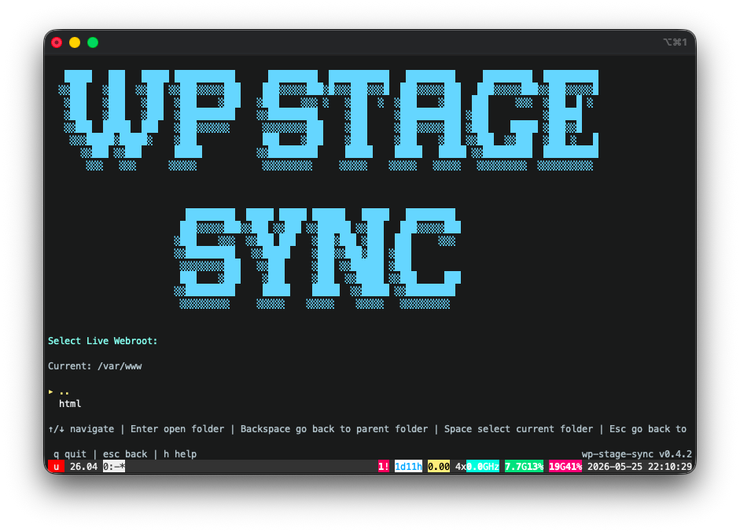
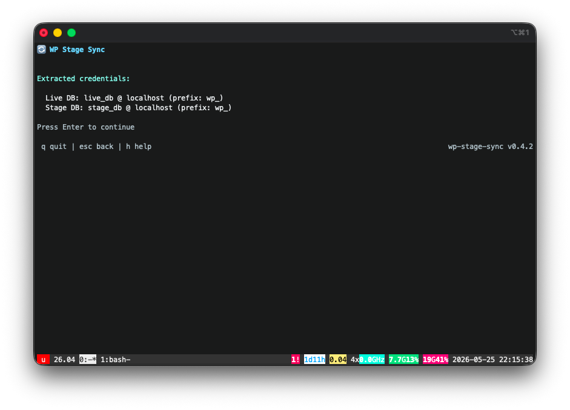
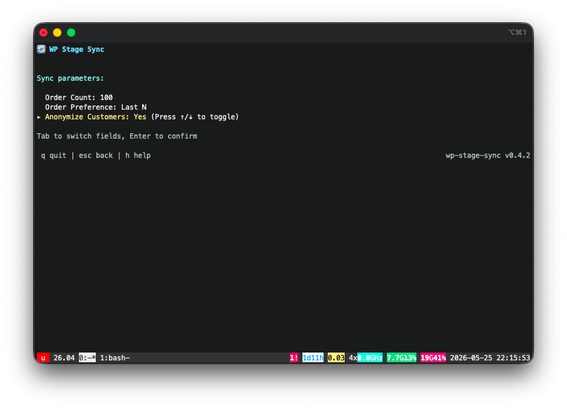
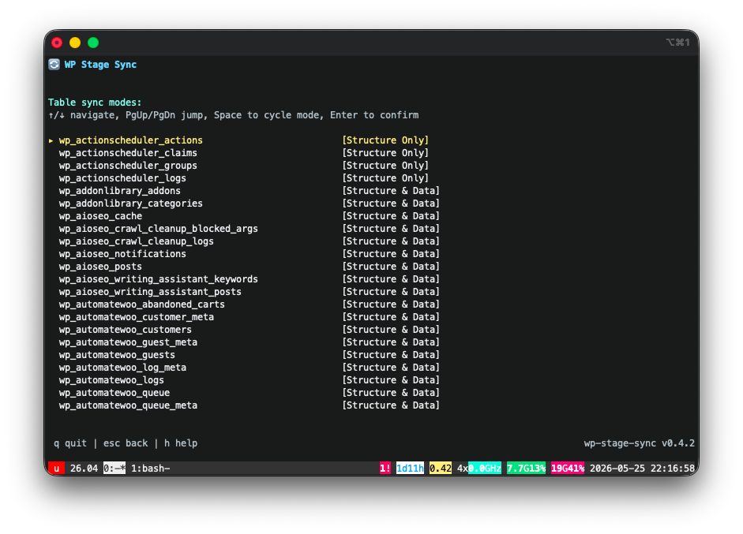
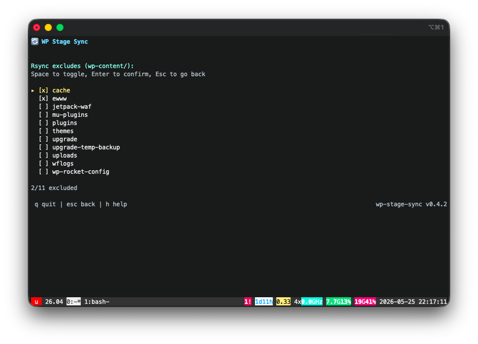
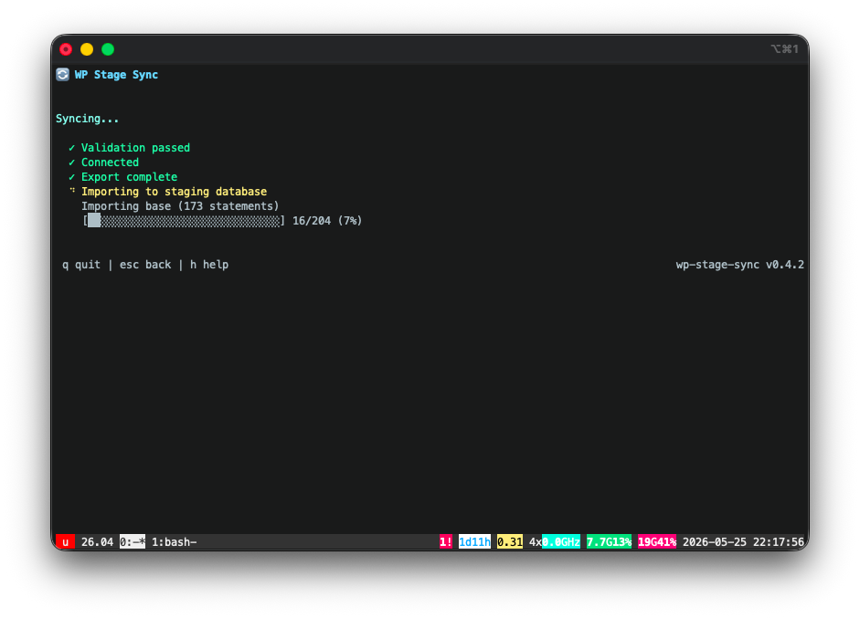
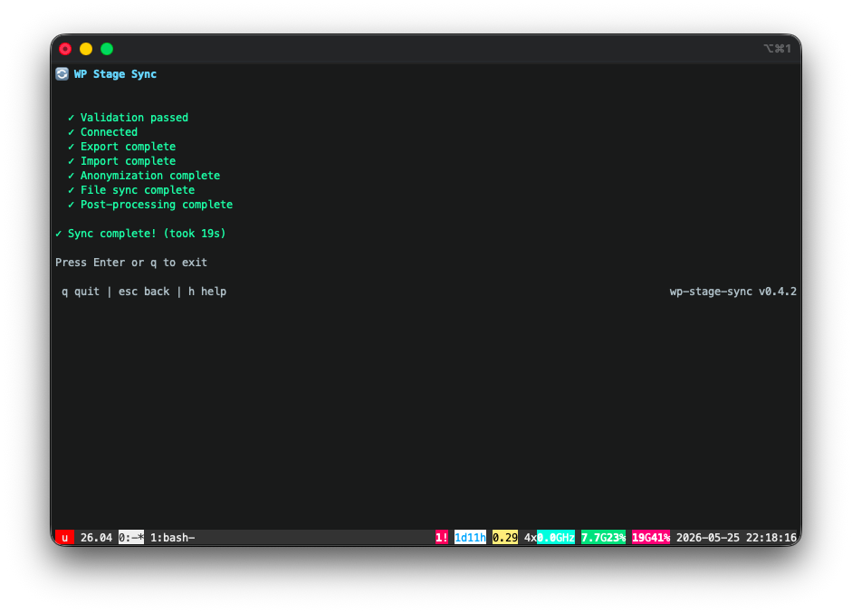

# WP Stage Sync

A TUI (Terminal User Interface) tool to synchronize WordPress sites between live and staging environments. Pull live to staging with smart WooCommerce order filtering and customer anonymization, or promote specific themes/plugins from staging to live with automated backup and atomic restore.



## What it does

### Live → Staging (default mode)

- **Smart Detection**: Automatically detects whether WooCommerce is installed.
- **WooCommerce Filtering (HPOS)**: Copies staging database with **filtered order data** — only the N orders you specify, not the entire order history.
- **Customer Anonymization**: Optionally masks billing/shipping addresses, customer names, emails, and phone numbers in the staging environment.
- **Non-customer preservation**: Keeps all admins, editors, and shop manager accounts fully intact.
- **Full WordPress Sync**: Works seamlessly with clean, non-WooCommerce WordPress instances as a fast, full sync tool.
- **File Sync**: Syncs `wp-content/` via rsync with customizable folder exclusion.
- **Domain Mapping**: Runs search-replace for domain URLs and handles Elementor / Jetpack URL settings automatically.
- **Production Guardrails**: **Never writes to production** — read-only access to the live database, all mutations target staging only.

### Staging → Live (promote mode)

- **Surgical Promote**: Select specific themes, plugins, and mu-plugins to promote from staging to live.
- **Automated Backup**: Creates a tar.gz backup of live assets before any changes, with configurable retention.
- **Atomic Restore**: Automatically restores from backup if any rsync operation fails mid-promote.
- **Restore Mode**: Browse and restore any previous backup from the TUI.

## Requirements

- Go 1.21+ (build only)
- Linux server with:
  - MySQL/MariaDB
  - rsync
  - WP-CLI
  - Apache2 / Nginx (optional, used for auto-discovery)

## Install

### Quick install (Linux)

```bash
curl -sL "https://github.com/AdaDigitalAgency/wp-stage-sync/releases/latest/download/wp-stage-sync_linux_$(uname -m | sed 's/x86_64/amd64/;s/aarch64/arm64/')" -o /tmp/wp-stage-sync && chmod +x /tmp/wp-stage-sync && sudo mv /tmp/wp-stage-sync /usr/local/bin/wp-stage-sync
```

### From source

```bash
go install github.com/AdaDigitalAgency/wp-stage-sync/cmd/wp-stage-sync@latest
```

## Usage

### Interactive mode (TUI)

```bash
wp-stage-sync
```

Walks you through:

1. **Path selection** — auto-discovers WordPress installs from web server vhosts and filesystem
2. **Credential extraction** — parses `wp-config.php` automatically
3. **WooCommerce Sync Options** — (If WooCommerce is present) select order count, preference, and choose whether to anonymize customer profiles
4. **Table selector** — choose sync mode per table (Structure & Data / Structure Only / Ignore / Custom Rule)
5. **Rsync Exclude selector** — interactively toggle which `wp-content/` folders to exclude from file sync
6. **Confirm & sync**

Settings are saved to `~/.config/wp-stage-sync/sites/` for reuse.

### Promote mode

```bash
wp-stage-sync --promote
```

Promotes selected themes, plugins, and mu-plugins from staging to production. Creates a backup before each operation. Press `p` on the startup screen for quick access.

### Restore mode

```bash
wp-stage-sync --restore
```

Browse previous backups and restore specific items to live. Press `r` on the startup screen when backups exist.

### Unattended mode

```bash
wp-stage-sync -u
```

Skips the TUI, reads saved config, and runs the sync immediately. Useful for cron jobs or scripts.

### Multi-site targeting

```bash
wp-stage-sync -l            # or --list
```

Lists all configured sites. Use this to discover available site identifiers.

```bash
wp-stage-sync -u -s example.com
wp-stage-sync --promote --site example.com
```

When multiple sites are configured, use `-s` / `--site` to specify which one. The site identifier is the directory name under `~/.config/wp-stage-sync/sites/` — typically the domain or webroot basename. Supports servers with multiple WordPress installs on the same domain.

### Version & Help

```bash
wp-stage-sync --help
wp-stage-sync --version
```

### Self-update

```bash
wp-stage-sync --update
```

Downloads the latest release from GitHub and replaces the binary in-place.

### Config management

```bash
wp-stage-sync --delete --site example.com   # remove a single site's config and backups
wp-stage-sync --reset                       # wipe all saved configs
```

Both prompt for confirmation before deleting.

### Settings screen

Press `s` from the first screen of the TUI to access global settings:
- **Backup retention**: Maximum number of backups to keep per site (default: 5)
- **Auto cache flush**: Whether to automatically flush cache on the live site after promote and restore operations (default: ON)

Settings are persisted to `~/.config/wp-stage-sync/settings.json`.

## How it works

### Database export (Step 0)

1. **Target orders** — queries `wc_orders` for the N most recent (or oldest) order IDs
2. **Safe users** — keeps all non-customer users unconditionally, plus customers linked to target orders
3. **Filtered tables** — HPOS tables (`wc_orders`, `wc_order_addresses`, `wc_orders_meta`, etc.) and WooCommerce lookup tables (`wc_order_stats`, `wc_order_product_lookup`, `wc_order_tax_lookup`, `wc_order_coupon_lookup`) are exported with `WHERE order_id IN (...)` filters
4. **Structure-only tables** — `woocommerce_sessions` and `actionscheduler_*` get schema only (no data)
5. **Base tables** — everything else copies as-is

### Database import (Step 1)

Drops all staging tables, imports with `FOREIGN_KEY_CHECKS=0`.

### File sync (Step 2)

```
rsync -av --delete --exclude='cache' --exclude='ewww' \
  --exclude='critical-css' --exclude='litespeed' \
  --exclude='updraft' --exclude='archive-master-db' \
  /home/{domain}/wp-content/ /home/stage.{domain}/wp-content/
```

Ownership is detected from the staging webroot and applied via `chown -R`. Falls back to `www-data:www-data`.

### Post-processing (Step 3)

```bash
wp search-replace https://{domain} https://stage.{domain} --all-tables --allow-root
wp elementor replace-urls https://{domain} https://stage.{domain} --allow-root
wp cache flush --allow-root
```

## Safety

The tool has built-in production guardrails:

- **Read-only on production** — the live database connection only runs `SELECT` and `SHOW` queries. Zero `INSERT`, `UPDATE`, `DELETE`, or `DROP` statements touch production.
- **Path validation** — aborts if live and stage paths resolve to the same directory
- **Database validation** — aborts if live and stage point to the same database name + host
- **Staging-only mutations** — all `DROP TABLE`, `INSERT INTO`, rsync `--delete`, `chown`, and WP-CLI commands target the staging environment exclusively

## Screenshots

| Credential extraction | Sync parameters | Table sync modes |
|:---:|:---:|:---:|
|  |  |  |
| **Rsync excludes** | **Sync in progress** | **Results** |
| [](website/images/screenshot-05.png) | [](website/images/screenshot-06.png) | [](website/images/screenshot-07.png) |

## Project structure

```
cmd/wp-stage-sync/main.go     Entry point, CLI flags, unattended orchestration
internal/
├── config/config.go          JSON config persistence (~/.config/wp-stage-sync/sites/)
├── db/db.go                  DB connection (root socket → wp-config fallback)
├── discovery/discovery.go    Apache2 vhost + filesystem auto-discovery
├── export/export.go          Core export engine (orders, users, HPOS, base)
├── guardrail/guardrail.go    Production safety checks (path, DB, wp-content)
├── promote/promote.go        Stage → live promote engine (backup, rsync, restore)
├── sync/sync.go              Import, rsync, WP-CLI post-processing
├── tui/tui.go                Bubbletea interactive wizard
└── wpconfig/wpconfig.go      wp-config.php parser
```

## WooCommerce compatibility

- **HPOS**: Required. The tool queries `wc_orders` (not `wp_posts`) for order data.
- **Backwards compatibility**: Must be disabled. Legacy `wp_posts`-based order tables are not filtered.

## License

[MIT](LICENSE)
